<div align="center">

<h3><code>aditya@github ~ $ ./contributions.sh</code></h3>



<br><br>

<h3><code>aditya@github ~ $ whoami</code></h3>

<table>
<tr>

<td valign="top">

</td>

<td valign="top">

</td>

</tr>
</table>

</div>
<div align="center">

<h3><code>aditya@github ~ $ ./profile.sh</code></h3>

<table>
<tr>

<td valign="top">

</td>

<td valign="top">

</td>

</tr>
</table>

</div>

<br>

<div align="center">

<h3><code>aditya@github ~ $ whoami</code></h3>

</div>
<div align="center">

# Aditya Kumar

### `CSE (AI & ML) Student | AI/ML Developer | LLM & RAG Enthusiast`

<p>
Building practical AI systems, experimenting with local LLMs,
and turning machine learning concepts into working applications.
</p>

</div>

---


I'm a Computer Science and Engineering student specializing in
Artificial Intelligence and Machine Learning at VIT Chennai.

My interests include:

- Artificial Intelligence & Machine Learning
- Large Language Models and RAG
- Computer Vision
- Natural Language Processing
- Deep Learning
- AI system development and evaluation

I enjoy building practical projects that combine machine learning,
software engineering, and AI.

---

## `$ cat skills.txt`

```text
Languages
├── Python
├── Java
├── C / C++
└── SQL

AI / Machine Learning
├── Machine Learning
├── Deep Learning
├── NLP
├── Computer Vision
├── RAG
├── LLM Evaluation
└── Prompt Engineering

Frameworks & Libraries
├── PyTorch
├── TensorFlow
├── Keras
├── Scikit-learn
├── OpenCV
├── Pandas
└── NumPy

AI / Developer Tools
├── Ollama
├── FAISS
├── Git
├── GitHub
├── Linux
├── VS Code
└── Streamlit

Web / Database
├── HTML
├── CSS
├── JavaScript
├── React
├── SQL
└── MongoDB
$ ls projects/
🤖 Local LLM Automation Assistant
Python · Ollama · RAG
An offline AI assistant for email summarization and workflow
automation using locally hosted large language models.
- Integrated local LLMs with Retrieval-Augmented Generation
- Built modular agents for email analysis
- Implemented document retrieval workflows
📚 Mini AI Knowledge Assistant
Python · FAISS · Sentence Transformers · Ollama · Streamlit
A local PDF-based RAG system that answers questions using
information retrieved directly from uploaded documents.
- PDF text extraction using PyMuPDF
- Semantic embeddings using Sentence Transformers
- Vector search using FAISS
- Local generation using Ollama
🛡️ Credit Card Fraud Detection
Python · XGBoost · Scikit-learn
Machine-learning based fraud detection using highly
imbalanced transaction data.
- Data preprocessing and feature scaling
- XGBoost classification
- Imbalanced-data experimentation
- Evaluation using precision, recall and ROC-AUC
😴 Driver Drowsiness Detection
Python · OpenCV · Computer Vision
Real-time driver monitoring system using facial landmarks
and Eye Aspect Ratio (EAR).
- Real-time drowsiness detection
- Facial landmark analysis
- Alert generation for prolonged eye closure
📱 SMS Spam Detection
Python · Scikit-learn · NLP
Machine-learning based classification of SMS messages
as Spam or Ham.
- TF-IDF feature extraction
- Logistic Regression and SVM
- NLP preprocessing
- Classification performance evaluation
🖼️ Image-to-Text-to-Speech
Python · OCR · Text-to-Speech
Application that extracts text from images and converts
the extracted text into spoken output.
$ experience
AI Intern — Avantel
Jun 2025 – Jul 2025
- Assisted in integrating AI solutions into enterprise workflows
- Deployed local Large Language Models using Ollama
- Implemented Retrieval-Augmented Generation for internal knowledge retrieval
- Evaluated and benchmarked open-source AI models
Software Intern — B-Hub
Jun 2023 – Jul 2023
- Contributed to an educational platform focused on regional-language learning
- Assisted with frontend development and software testing
- Worked in an agile startup environment
$ currently-learning
→ Large Language Models
→ Retrieval-Augmented Generation
→ AI Agents
→ Model Evaluation
→ Advanced Machine Learning
→ Data Structures & Algorithms
→ Cloud / AWS

$ achievements
🏆 Rank 25 — Bitwars 2.0 Competitive Coding Event
🎯 Completed multiple AI/ML and software development projects
$ interests
AI / ML
Guitar
Basketball
Gaming
Building Projects

<div align="center">

Building → Learning → Breaking → Fixing → Building Again
</div>
```